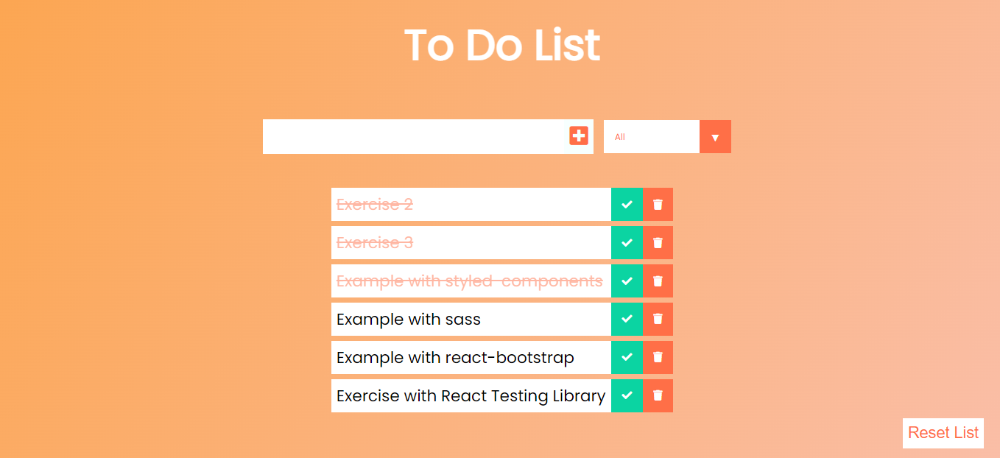

<h1 align="center">
  
</h1>

# REACT TO DO

O projeto React to do é uma lista de tarefas que podem ser excluídas, filtradas e marcadas como tarefas completadas.

O botão de excluir tarefas, representada pelo ícone de lixo, remove os itens da lista mas mantém o item de objeto de armazenamento local.

Esta aplicação salva, adiciona, recupera ou exclui dados localmente em um navegador Web através do localStorage, o botão 'Reset List' remove o item do localStorage e limpa a lista.

Obs: Em inglês `uncompleted` se traduz como algo que precisa ser feito, está em andamento ou que está para terminar.

<p align="center">
 <a href="#tecnologias">Tecnologias</a> • 
 <a href="#pré-requisitos">Pré-requisitos</a> •
 <a href="#rodando-o-react-to-do">Rodando o React to do</a>
</p>

## Tecnologias

As seguintes ferramentas/bibliotecas foram usadas na construção do projeto:

- [Node.js](https://nodejs.org/en/)
- [React](https://pt-br.reactjs.org/)

## Pré-requisitos

- [Git](https://git-scm.com)
- [Node.js](https://nodejs.org/en/)
- um editor de código, como o [VSCode](https://code.visualstudio.com/)

## Rodando o React to do

```bash
# Clone este repositório
$ git clone <https://github.com/Alice7H/react-to-do.git>

# Acesse a pasta do projeto no terminal/cmd
$ cd react-to-do

# Instale as dependências
$ npm install
#ou
$ yarn install

# Execute a aplicação em modo de desenvolvimento
$ npm start
#ou
$ yarn start

# O projeto inciará na porta:3000 - acesse <http://localhost:3000>
```
